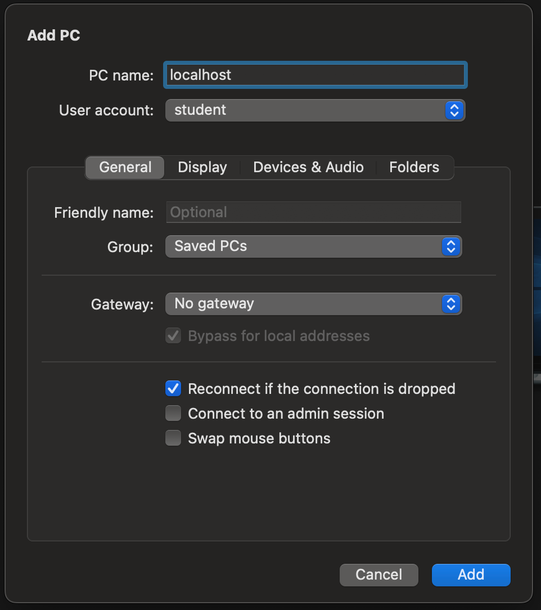

**This information is primarily targeted at students who have Macs with Apple Silicon (M1 or M2) and no other useful options for running the course software.**

(1)  Get an account on [Digital Ocean](https://www.digitalocean.com/).  Note that this is a commercial cloud service provider who will charge you money.  That is between you and them.  I don’t have any connection with them other than I have been a customer of their for several years and have been satisfied with their services.  It is likely that you would be able to use the exact same course VM image with a different cloud provider, but I have not looked into this.

(2)  While signed into your Digital Ocean account on their webpage, use the menu on the left hand side of the screen to navigate to “Images”.   On the “Images” page, select the “Custom Images” tab.

(3)  Click the “Import via URL” button.  When presented with the “Upload an Image” pop-up, enter the URL of the “cloud-friendly” CSE320 VM image: [http://www.starkeffect.com/public/CSE320\_Fall24.vmdk](http://www.starkeffect.com/public/CSE320_Fall24.vmdk) . When it asks you for "Distribution", you should select "Ubuntu".

**NOTE:** There seem to be some issues associated with attempting to directly upload the image from my server as indicated above (see further notes below.  The symptoms would be extremely long processing time or long processing time followed by the image disappearing from the dashboard without a trace.  I have some indications from people that this can be avoided by first downloading the image from the URL above to your own computer, then uploading the image to Digital Ocean from your computer.  I originally didn't suggest this because it involves an additional transfer of this large image; however, if it solves the processing problem then that is perhaps what you should do.

**NOTE:**  _I am hosting this image on my own server (also on Digital Ocean) for the moment, but I will probably not leave it up there after the first couple of weeks of class or so, because downloads of it get charged against my monthly data transfer allotment._

Once you have entered the URL, you should get something with a check mark that says “Pending”.  A red X and an “Error” indication means that something went wrong.  It takes quite awhile (something like an hour or two, but see note below) for this upload to process.  Leave it alone and go do something else until it is finished.  As long as it still says “Pending” it is still working and you should leave it alone.  If you don’t you will have to start all over again with this time-consuming step.  Once the processing has completed, it will no longer say “Pending” and instead will indicate the presence of the custom image within your account.

**NOTE:** In the past, the VM image upload has typically stayed in the "Pending" state for an hour or two until it was ready for use.  However, processing would sometimes fail mysteriously.  In August 2024, when I uploaded the Fall 2024 image to my account, after it failed once and hung "forever" another time, I was able to get the image uploaded after over 14 hours.  I have a ticket in with Digital Ocean about this problem, and supposedly their Engineering Department is "looking into it", but I don't have high hopes at the moment.  Quite frankly, I don't know what your experience will be when you try to upload the image.  There is another way that I can get you the image, and that is to transfer a snapshot of it from my account to yours, but this requires manual intervention on my part for each person to whom I have to transfer the image.  If necessary, I will do this, but first see if you can get the image uploaded the normal way.

_**NOTE:** There is a cost associated with keeping the custom image in your account.  However, it is only something like $0.50/month and if you have the custom image you can spin up a droplet in a matter of minutes, rather than having to repeat the lengthy upload procedure.   So I recommend keeping it around in case you mess up your droplet and you need to destroy it and make a new one._

(4)  From the dropdown menu to the right of the custom image indication, choose “Start a droplet”.   At that point you will have to select the type of droplet that you want and this will affect the cost.  The type of droplet that it suggests costs something like $56/month and it is overkill.  I would suggest choosing a “Basic droplet” with 1 VCPU, 2GB RAM, and 50GB of disk space.  This should be adequate for the course work, and there are ways to reconfigure the droplet with more CPUs, memory, or disk later if you really need to do it.  Because of the size of the virtual disk in the VM image, you cannot use the 25GB disk drive.  A droplet with my suggested parameters is currently $12/month.   You probably want to select a droplet in one of their NYC data centers to reduce communication latency (i.e. “lag”). 

It is also necessary to select an SSH key at this point.  You will have to previously have uploaded at least one SSH public key to your Digital Ocean account.  It will let you choose one or more of any SSH keys that are available in your account (of course, this does mean that you will have to make an effort to learn how to create an SSH key and use SSH, but that is not a bad thing). Click on “Create”.  This will take maybe 5 minutes, after which it will the droplet will be running and it will show you the IP address.  In the following, suppose the IP address is “xxx.yyy.zzz.www”.

(5)  Before the droplet is ready for normal use, you need to log in as “root” and add your SSH public key to the “student” account.  Do this as follows:

(a) SSH into the root account on the droplet:

`ssh -l root xxx.yyy.zzz.www`

(b) Then execute the following commands:

`su -l student`

`cat > ~/.ssh/authorized_keys`

\[Copy your .ssh public key to the clipboard, then right click in the terminal window and select “Paste”.  Make sure that is a complete line of input that ends with a final newline.\]

`^D`

\[This means hold down the CTRL key and press the ‘d’ key on the keyboard.  That generates an end-of-file indication for “cat” and you should get back to the shell prompt.\] © Check the contents of `~/.ssh/authorized_keys` to make sure that it properly contains a single line with your SSH public key. (d) Use “exit” twice: once to exit from the “sudo” shell  and the second time to log out of the system.

(6)  From your local computer, verify that you can log in to the droplet using SSH to the unprivileged “student” account:

`ssh -l student xxx.yyy.zzz.www`

If it doesn’t work, then you did something wrong in setting up the `authorized_keys` file, so you have to go back in as root and fix that. If it does work, then you should log out using “exit” and then you are ready to try remote desktop.

(7)  \[Thanks to Dylan Scott for supplying this part of procedure and testing it on his Mac.  I reordered it slightly.\]

a) Install the “Microsoft Remote Desktop” app from the Apple App Store using the following link: 

[https://apps.apple.com/us/app/microsoft-remote-desktop/id1295203466?mt=12](https://apps.apple.com/us/app/microsoft-remote-desktop/id1295203466?mt=12)

b) Open “Terminal” on the Mac, then execute the command

`ssh -L 3389:localhost:3389 student@[IP ADDRESS]`

(replacing the `[IP ADDRESS]` with the one for your droplet). Note that this Terminal window must stay open while you are remoted in.

c) Open “Microsoft Remote Desktop” and click “Add PC” d) Type in “localhost” as the PC Name and select “Add User Account…” under the user account dropdown. e) Enter “student” as the username and “cse320” as the password then click “Add.” Settings should look like in the image below. f) Click “Add,” then double-click on “localhost” entry to connect.  It may take a minute for the desktop environment to load up but you should now have access to the remote VM.

**NOTE:**  After setting up the cloud-based VM, you might find that "git-submit" cannot be found after you log in via Remote Desktop.  You should be able to correct this using the following procedure (do this on the cloud system desktop environment):

- Open a terminal window using the icon at the bottom of the desktop.
- Use the Edit menu of the terminal window and select "Preferences".
- When the Preferences window pops up, select the "Command" tab.
- Check the box that says "Run command as a login shell".
- Close the terminal window and now try opening a new terminal window.  It should be that the PATH is now correct and "git submit" should work.

